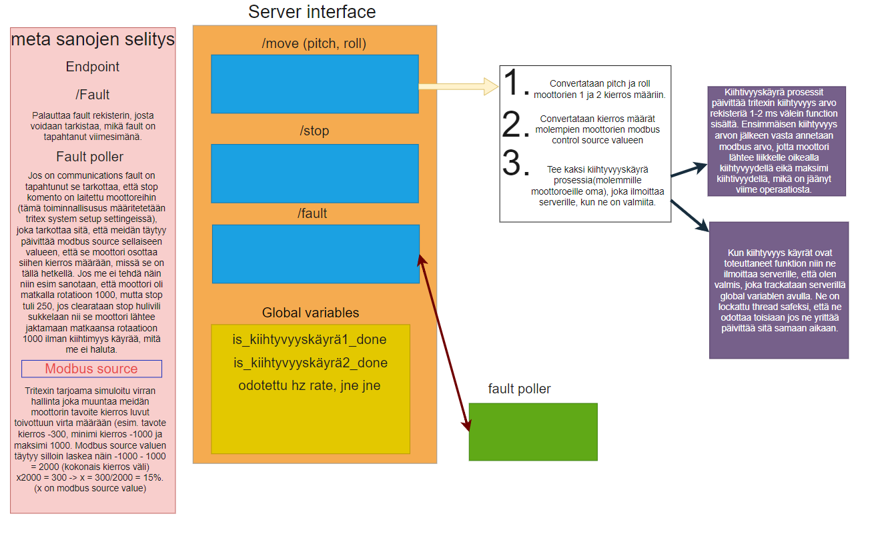

# Liikealustan Rajapinta Ryhmä 14 
Projektin tekijät:

- **Olli Kangasniemi** - [TODO -> vastuu alue]
- *Emil Frisk* - [TODO -> vastuu alue]
- **Juuso Vainio** - [TODO -> vastuu alue]
- *Mikko Pentikäinen* - [TODO -> vastuu alue]
- **Marko Karttunen** - [TODO -> vastuu alue]

## Esittely
Toteutamme projektin Savonian Ai-MaSi-hankkeeseen. Ai-MaSi eli Artificial Intelligence Machine
Simulation on hankeprojekti, jonka tarkoituksena on opettaa koneäly operoimaan kaivinkonetta kolmessa vaiheessa: ensin digitaalisena kaksosena simulaatioympäristössä, sitten pienoismallikaivurina ja lopulta oikeana työkoneena. Tässä projektissa keskitymme simulaatioympäristön liikealustan
kehittämiseen. Päämääränämme on rajapinnan kehittäminen Mevean valmistamaan liikealustaan.
Rajapinnan tulee pystyä muuntamaan tulevat kallistus ja kiihtyvyys tiedot reaaliaikaisesti liikealustassa oleville kahdelle Tritex servomoottorille. Servomoottorit liikuttavat liikealustaa ja simuloivat
käyttäjälle reaaliaikaisesti kohdelaitteen liikkeitä. 

## Arkkitehtuuri
### Kaavio

### Flask web-palvelin
Rajapinta on toteutettu flaskilla tehtyyn web-palvelimeen. Se koostuu 6 rajapinnasta, globaaleista muuttujista ja apumoduuleista.

- **Fault Poller Moduuli**: Tarkkailee ajureihin tulevia vikoja ja korjaa ne mahdollisesti automaattisesti. Siihen on toteutettu myös viastapalautuminen, jos fault-poller kaatuu se lähettää palvelimelle viestin, että se täytyy käynnistää uudelleen, koska järjestelmä ei saa olla päällä ilman tätä moduulia.

- **Kiihtyvyydenohjaus Moduuli**: Hallitsee moottorin kiihtyvyyttä, jotta se on tasaisempi. Ilmoittaa palvelimelle, kun ne on valmiita.

- **Moottoreiden statuksen tarkkailu**: Palvelimella olevien globaalien muuttujien avulla.

- **Ajureiden kanssa kommunikaatio**: Kaikki kommunikaatio tapahtuu Modbus-TCP protokollan avulla ja jokainen moduuli on jaettu käyttämään omia TID(tunnistaa pyynnön) arvovälejä, jotta ei tule pakettikolareita.